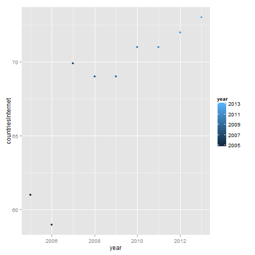

Internet and Mobile penetration Trend in ASEAN Region
========================================================
author: Isak Rabin
date: 26 April 2015
font-family: 'Helvetica'

Introduction
========================================================

Asia Pacific is the world as largest mobile and internet region but also one of the most diverse regions in terms of the levels of both economic and mobile market development. 

In this case study, we would like to study Internet and Mobile penetration in ASEAN as one of the most growing area in Asia Pacific, and the effective way delivering this information by using shiny application.


Dataset
========================================================

The dataset is taken from World Bank Database (http://databank.worldbank.org/data/home.aspx):
* Internet Penetration for ASEAN Countries (Singapore, Malaysia, Indonesia, Thailand, Philippine, Cambodia, Myanmar)
* Internet Penetration for ASEAN Countries (Singapore, Malaysia, Indonesia, Thailand, Philippine, Cambodia, Myanmar)

From those 2 data, we calculate average on Internet and Mobile penetration among those countries.

Shiny is used to present the timeseries data:
* Shiny allows interactivity
* Shiny is relatively simple (short turn-around)


Analysis
========================================================

The data shows that Internet penetration trend among ASEAN countries are totally diversified.
While, the trend for Mobile penetration are mostly balance, except for emerging market like Myanmar and Cambodia.

Singapore as the most developed country in region, dominate Internet and Mobile penetration in the region.
While Cambodia and Myanmar in the bottom 2.

The following code plots Internet and Mobile Trend in Singapore compare to other ASEAN countries.


```r
qplot("year", "countriesInternet", data=subset(dataset, countries=="Singapore"))
qplot("year", "countriesMobile", data=subset(dataset, countries=="Singapore"))
```


Effective Plot
========================================================

Single country plot: clear info, no trend.
 

***

Time series plot: too much info but can see trends
 


Conclusion
========================================================

The full timeseries is plotted as web application using Shiny instead:
https://sgirabin.shinyapps.io/coursera-develop-data-product-project/
$year
Shiny interactivity allows the user to observe the info year by year clearly.

Based on the observed trend, the following are conclusions:
* Singapore’s internet penetration is 73% (2013). However, poor penetration in other ASEAN Countries is bringing down SEA’s average to 34%(2013)
* Myanmar is the lowest mobile penetration in SEA's with only 12.83% (2013) compare to SEA's average of 118.52% (2013). Again, Singapore has the highest mobile penetration rate with 155.92% (2013) for every 100 people. It means, more than 50% population has at least 1 or more mobile phone.
* Shiny's interactivity allows users to focus on a number of information on particular countries & observe trend over time

